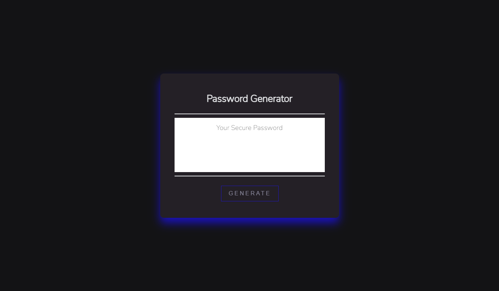

# Password Generator

## Description

A random password generator created with HTML, CSS and JavaScript. 

Users can generate strong passwords that provide greater security by 
answering a series of password criteria prompts including desired 
length and character types. 

## Snapshot 

## Link 

https://chloeharris1.github.io/passwordgenerator/

## License
Licensed under the MIT license.

## Questions 
[Email Me](Chloe.a.harris17@gmail.com) if you have any questions.

Check out more of my work on [GitHub](https://github.com/chloeharris1).
